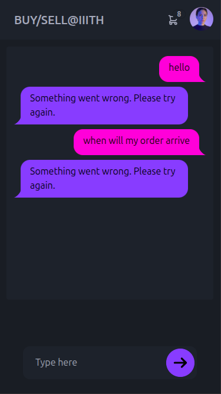

# BUY-SELL-IIITH 🛒


A marketplace platform designed specifically for the IIIT Hyderabad community to buy and sell items among students, faculty, and staff.

## 📋 Table of Contents
- [About](#about)
- [Screenshots](#screenshots)
- [Features](#features)
- [Tech Stack](#tech-stack)
- [Getting Started](#getting-started)
- [Installation](#installation)
- [Usage](#usage)
- [API Documentation](#api-documentation)
- [Contributing](#contributing)
- [License](#license)

## 🎯 About

BUY-SELL-IIITH is a web-based marketplace platform that enables the IIIT Hyderabad community to easily buy and sell items within the campus. Whether you're looking to sell textbooks, electronics, furniture, or any other items, this platform provides a secure and convenient way to connect with other community members.

## 📸 Screenshots





<!-- To add your images:
1. Create a 'docs/images' folder in your project root
2. Add your screenshot files (homepage.png, item-details.png)
3. Update the image paths above to match your file names
-->

## ✨ Features

- 🔐 **Secure Authentication** - Login with IIITH credentials via CAS
- 🛡️ **Google reCAPTCHA** - Bot protection for forms and registration
- 🎓 **CAS Integration** - Single Sign-On with IIITH authentication system
- 📱 **Responsive Design** - Works seamlessly on desktop and mobile
- 🛍️ **Item Listings** - Create detailed product listings with images
- 🔍 **Advanced Search & Filters** - Multi-parameter search with real-time filtering
  - Text-based search across titles and descriptions
  - Category-wise filtering (Electronics, Books, Furniture, etc.)
  - Price range filters with custom min/max values
  - Condition filters (New, Like New, Good, Fair)
  - Location-based search within campus areas
  - Date range filtering (Recently added, This week, This month)
  - Sorting options (Price: Low to High, High to Low, Newest, Oldest)
  - Saved search preferences for quick access
- 💬 **In-app Messaging** - Direct communication between buyers and sellers
- ⭐ **Rating System** - Rate and review transactions
- 📊 **User Dashboard** - Manage your listings and purchases
- 🏷️ **Category Management** - Organized product categories
- 📍 **Location Tags** - Campus location-based listings

## 🛠️ Tech Stack

### Frontend
- **React.js** - UI framework
- **HTML5/CSS3** - Markup and styling
- **JavaScript (ES6+)** - Programming language
- **Google reCAPTCHA v2/v3** - Bot protection

### Backend
- **Node.js** - Runtime environment
- **Express.js** - Web framework
- **MongoDB** - Database with full-text search indexing
- **JWT** - Authentication tokens
- **CAS (Central Authentication Service)** - IIITH SSO integration
- **Google reCAPTCHA** - Server-side verification
- **Elasticsearch** (Optional) - Advanced search capabilities

### Authentication
- **IIITH CAS Server** - Single Sign-On authentication
- **Passport.js** - Authentication middleware
- **CAS Strategy** - CAS protocol implementation

## 🚀 Getting Started

### Prerequisites
- Node.js (v14 or higher)
- npm or yarn
- MongoDB (local or cloud instance)
- Git
- Google reCAPTCHA Site Key and Secret Key
- IIITH CAS server access

### Installation

1. **Clone the repository**
   ```bash
   git clone https://github.com/yourusername/BUY-SELL-IIITH.git
   cd BUY-SELL-IIITH
   ```

2. **Install Backend Dependencies**
   ```bash
   cd backend
   npm install
   ```

3. **Install Frontend Dependencies**
   ```bash
   cd ../frontend
   npm install
   ```

4. **Environment Setup**
   Create `.env` files in both frontend and backend directories:
   
   **Backend `.env`:**
   ```env
   PORT=5000
   MONGODB_URI=mongodb://localhost:27017/buysell-iiith
   JWT_SECRET=your_jwt_secret_key
   NODE_ENV=development
   
   # CAS Configuration
   CAS_BASE_URL=https://cas.iiith.ac.in/cas
   CAS_SERVICE_URL=http://localhost:5000/auth/cas/callback
   CAS_VERSION=3.0
   
   # Google reCAPTCHA
   RECAPTCHA_SITE_KEY=your_recaptcha_site_key
   RECAPTCHA_SECRET_KEY=your_recaptcha_secret_key
   ```
   
   **Frontend `.env`:**
   ```env
   REACT_APP_API_URL=http://localhost:5000
   REACT_APP_RECAPTCHA_SITE_KEY=your_recaptcha_site_key
   ```

5. **Start the Development Servers**
   
   **Backend:**
   ```bash
   cd backend
   npm run dev
   ```
   
   **Frontend:**
   ```bash
   cd frontend
   npm start
   ```

6. **Access the Application**
   - Frontend: `http://localhost:3000`
   - Backend API: `http://localhost:5000`

## 📖 Usage

1. **CAS Login**: Click "Login with IIITH" to authenticate via CAS
2. **Registration**: Complete reCAPTCHA verification during signup
3. **Search & Browse Items**: 
   - Use the search bar for keyword-based search
   - Apply filters from the sidebar (category, price, condition, location)
   - Sort results by relevance, price, or date
   - Save frequently used search filters
4. **Create Listings**: Click "Sell Item" to create a new product listing (with reCAPTCHA)
5. **Contact Sellers**: Use the messaging system to communicate with sellers
6. **Manage Profile**: Update your profile and view transaction history

## 🔍 Search & Filter Functionality

### Search Features
- **Full-Text Search**: Search across item titles, descriptions, and tags
- **Auto-Complete**: Smart suggestions as you type
- **Search History**: Recently searched terms for quick access
- **Typo Tolerance**: Find results even with minor spelling errors

### Filter Options
- **Categories**: Electronics, Books, Furniture, Clothing, Sports, etc.
- **Price Range**: Custom min/max price filters with slider
- **Condition**: New, Like New, Good, Fair, For Parts
- **Location**: Specific campus areas (Hostels, Academic Block, etc.)
- **Availability**: Available, Sold, Reserved
- **Date Posted**: Today, This Week, This Month, Custom Range
- **Seller Type**: Students, Faculty, Staff

### Advanced Features
- **Saved Searches**: Save filter combinations for quick access
- **Search Alerts**: Get notified when new items match your criteria
- **Similar Items**: Find items similar to current viewing
- **Popular Searches**: Trending search terms in the community

## 📚 API Documentation

### Authentication Endpoints
- `GET /api/auth/cas` - Initiate CAS login
- `GET /api/auth/cas/callback` - CAS callback handler
- `POST /api/auth/register` - User registration (with reCAPTCHA)
- `POST /api/auth/login` - Alternative login method
- `POST /api/auth/logout` - User logout
- `POST /api/auth/verify-recaptcha` - Verify reCAPTCHA token

### CAS-Specific Endpoints
- `GET /api/auth/cas/user` - Get current CAS user info
- `POST /api/auth/cas/validate` - Validate CAS ticket
- `GET /api/auth/cas/logout` - CAS logout with service redirect

### Item Endpoints
- `GET /api/items` - Get all items
- `POST /api/items` - Create new item listing
- `GET /api/items/:id` - Get specific item
- `PUT /api/items/:id` - Update item listing
- `DELETE /api/items/:id` - Delete item listing

### User Endpoints
- `GET /api/users/profile` - Get user profile
- `PUT /api/users/profile` - Update user profile
- `GET /api/users/:id/listings` - Get user's listings

### Search & Filter Endpoints
- `GET /api/search` - General search with query parameters
- `GET /api/search/suggestions` - Auto-complete suggestions
- `GET /api/search/filters` - Get available filter options
- `POST /api/search/advanced` - Advanced search with multiple filters
- `GET /api/search/popular` - Get popular search terms
- `POST /api/search/save` - Save search preferences
- `GET /api/search/saved` - Get user's saved searches
- `DELETE /api/search/saved/:id` - Delete saved search

#### Search Query Parameters
```
GET /api/search?q=laptop&category=electronics&minPrice=5000&maxPrice=50000&condition=new&location=hostel&sort=price_asc&page=1&limit=20
```

**Parameters:**
- `q` - Search query string
- `category` - Item category filter
- `minPrice` / `maxPrice` - Price range filters
- `condition` - Item condition filter
- `location` - Campus location filter
- `dateRange` - Date posted filter (today, week, month)
- `sort` - Sort order (price_asc, price_desc, date_desc, relevance)
- `page` - Page number for pagination
- `limit` - Items per page

### Filter Categories
```json
{
  "categories": ["Electronics", "Books", "Furniture", "Clothing", "Sports"],
  "conditions": ["New", "Like New", "Good", "Fair", "For Parts"],
  "locations": ["Hostel A", "Hostel B", "Academic Block", "Sports Complex"],
  "priceRanges": [
    {"label": "Under ₹500", "min": 0, "max": 500},
    {"label": "₹500 - ₹2000", "min": 500, "max": 2000},
    {"label": "₹2000 - ₹10000", "min": 2000, "max": 10000},
    {"label": "Above ₹10000", "min": 10000, "max": null}
  ]
}
```

### Search Setup Instructions

#### MongoDB Text Indexing
```javascript
// Create text indexes for search functionality
db.items.createIndex({
  "title": "text",
  "description": "text", 
  "tags": "text"
})

// Create compound indexes for filters
db.items.createIndex({ "category": 1, "price": 1 })
db.items.createIndex({ "location": 1, "createdAt": -1 })
```

#### Optional Elasticsearch Integration
1. Install Elasticsearch locally or use cloud service
2. Configure search indexing in backend
3. Set up real-time data synchronization
4. Enable advanced search features like fuzzy matching

## 🤝 Contributing

We welcome contributions from the IIITH community! Here's how you can help:

1. **Fork the repository**
2. **Create a feature branch**
   ```bash
   git checkout -b feature/amazing-feature
   ```
3. **Commit your changes**
   ```bash
   git commit -m 'Add some amazing feature'
   ```
4. **Push to the branch**
   ```bash
   git push origin feature/amazing-feature
   ```
5. **Open a Pull Request**

### Development Guidelines
- Follow the existing code style
- Write clear commit messages
- Add tests for new features
- Update documentation as needed

## 📄 License

This project is licensed under the MIT License - see the [LICENSE](LICENSE) file for details.

## 📞 Contact

- **Project Maintainer**: [Your Name](mailto:your.email@iiith.ac.in)
- **Issues**: [GitHub Issues](https://github.com/yourusername/BUY-SELL-IIITH/issues)
- **Community**: Join our [Discord Server](discord-link)

## 🙏 Acknowledgments

- IIIT Hyderabad for providing the platform
- All contributors who help improve this project
- The IIITH community for their valuable feedback

---

**Made with ❤️ for the IIITH Community**
